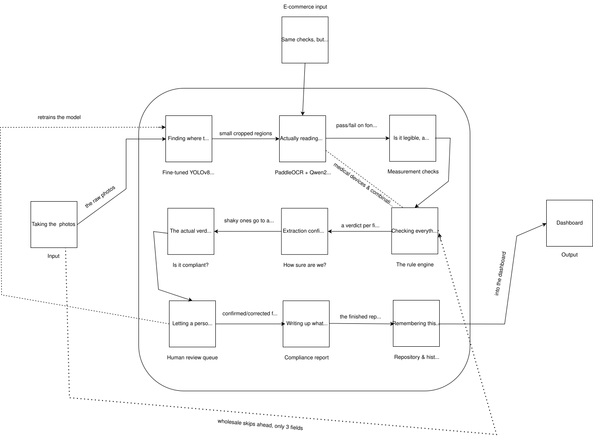

# SIH26034-Legal-Metrology

Software system to check compliance of packaged commodities under the [Legal Metrology (Packaged Commodities) Rules, 2011](docs/legal-metrology-packaged-commodities-rules-2011.pdf) by scanning products, images, and labels.

Built for Smart India Hackathon 2026 (SIH).

## Actual Problem Statement by Ministry

Packaged commodities are sold at massive scale across India, and every one must carry mandatory declarations (manufacturer details, net quantity, MRP, date, consumer care, etc.) under the Legal Metrology (Packaged Commodities) Rules, 2011. Manual inspection by enforcement agencies can't keep up with this volume and variety, so missing declarations, wrong font sizes, and improper MRP formats go frequently undetected. The Ministry wants a software system that scans product labels/images/listings, automatically detects and validates these declarations, flags non-compliance, and gives enforcement officials reports, dashboards, and a searchable compliance history.

## The Problem, Restated

A finite number of enforcement officers can't manually apply Legal Metrology's dozens of category-dependent, detail-heavy rules (exact font-size mm thresholds, standard package sizes, placement rules, banned wording, etc.) consistently across millions of SKUs. This creates three real failures: poor **coverage** (most products never get inspected), poor **consistency** (different officers catch different things), and weak **defensibility** (penalties escalate on repeat offenses, but without searchable history, officers can't easily prove repeat violations or produce audit-grade evidence). The real problem is giving one officer the rule-consistency and case-memory of an entire department, at the moment of inspection.

## Understanding the Actual Law

The problem statement does not define what "checking compliance" actually means. That part is left open, so this understanding comes from a full reading of the Legal Metrology Act, 2009 and the [Packaged Commodities Rules, 2011](docs/legal-metrology-packaged-commodities-rules-2011.pdf), along with every amendment made to them since. The version of this law most people casually reference is missing over a decade of changes.

### What every package is actually required to say

Strip away the legal language, and every retail package has to carry: the manufacturer's (or packer's, or importer's) name and address, the generic name of what's inside, the net quantity in a standard unit, the month and year it was made or packed, the MRP inclusive of all taxes, a way to contact consumer care, the country of origin if it's imported, and its dimensions if that's relevant to the product. Nine fields, roughly, and every one of them is checkable from a photo.

### The rules nobody talks about

A close reading of the text surfaces a few things that don't show up in casual summaries.

Font size isn't just "must be legible" in vague terms. The law sets exact minimum numeral heights in millimetres, scaled to the size of the label itself, and checking it needs an actual measurement, not just OCR confidence.

Where declarations sit on the package matters too. They have to appear on what the law calls the "principal display panel," and the Rules allow that information to be split across two different spots on the same package rather than grouped in one photographable area.

Color contrast between the printed numerals and the background is a real, stated requirement, not a styling preference.

Some words are banned outright near a quantity declaration: no "approximately," "about," "minimum," or similar hedge words.

Units follow a specific required format, down to using grams instead of kilograms under 1000g, and words like "dozen" or "score" are banned as a way of stating quantity.

A long list of everyday products can only legally be sold in specific sizes. Biscuits, tea, coffee, edible oil, cement, and soft drinks are all locked to a fixed list of allowed pack sizes in the Act's own schedule, so a 347-gram biscuit packet is a violation on its own, with no need to compare it against any external source.

The law also decides who's legally responsible for a violation, and it isn't always whoever's name is biggest on the label. An unqualified name is presumed to be the manufacturer; a name explicitly marked as the "marketer" shifts liability to the brand owner instead; and when more than one name appears, the law goes after whoever's listed first.

### Categories aren't all treated the same

Food, cosmetics, alcohol, and seeds each get one or two specific fields carved out to a different law entirely: food and cosmetics defer some wording to FSSAI and the Drugs and Cosmetics Rules, alcohol's MRP declaration defers to State Excise law, and seeds skip the manufacturing-date field. Everything else about those products still has to comply exactly like any other product; this is a handful of exceptions, not a blanket exemption.

Medical devices are their own separate story. They only came under Legal Metrology's scope in 2017, and in 2025 they were carved back out of the strict millimetre font-size rules specifically, since they now follow the Medical Devices Rules instead.

Retail and wholesale packages are genuinely different rule sets too. A wholesale package only needs three declarations, not the full retail list.

Combination, group, and multi-piece packages, gift sets and multi-item kits bundled as one product, are treated as their own package type rather than squeezed into retail or wholesale. The outer package is checked like a retail package for its own combined declarations (its own MRP, its own overall net quantity), and if individual items inside also carry their own printed declarations, each of those is checked the same way an individual retail package would be. This mirrors how the Rules already handle multi-component packages sold as one unit.

### What changed since 2011

The original 2011 text is not the current law. It has been amended several times, and most casual references to it are out of date.

**2017:** e-commerce listings became legally required to carry the same information as a physical label, with an exact list: manufacturer's name and address, country of origin, generic name, net quantity, best-before date, MRP, and dimensions. The date of manufacture is explicitly not required on a listing. The same amendment banned declaring two different MRPs on what's meant to be an identical product, and replaced the old weight-based font-size table with one keyed to the label's own area instead.

**2022:** added to the list of exempted packages, and allowed QR codes as an official way to display extra information for electronic devices.

**2023:** introduced new package categories, combination packages and group packages, essentially gift sets and multi-item kits, which don't fit cleanly into a simple retail-or-wholesale split.

**2024 (proposed, not yet finalized):** would extend mandatory declarations to currently-exempt bulk packages over 25kg. Worth watching, not yet something to design around.

### What's deliberately out of scope

Whether a package's actual weight matches its declared weight, the Maximum Permissible Error check, requires a calibrated scale. A camera cannot weigh anything, so this is a real, defensible boundary rather than an oversight.

"Deceptive packaging," an oversized box hiding a small product, is out for the same reason: there's no way to judge this from a 2D photo without a physical reference.

Whether a shop is actually charging at or below the printed MRP needs the till receipt rather than the package label, since it comes from a different data source entirely.

### Who this is actually for

This isn't assumed outright, but the problem statement's own language (dashboards for enforcement officials, role-based access, a searchable inspection history) points squarely at enforcement officers doing inspections as the intended users, not consumers or manufacturers checking their own labels.

## The Solution

At its core, this is a mobile-first tool for the enforcement officers described above. An officer photographs a packaged product, or captures a screenshot of an online listing, and the system takes it from there: detecting every legally required declaration, measuring what needs measuring, checking it all against the actual Rules, cross-checking the manufacturer against the [real government registry](https://lm.doca.gov.in/pcr/certificates), and producing a compliance report with a verdict tied to a specific rule. Anything the system isn't confident about gets routed to a person before any verdict is finalized, and every scan feeds a searchable history that determines penalty escalation on repeat offenses.

### The workflow, step by step

1. The officer selects the package type (retail, wholesale, or combination, group, and multi-piece) and the commodity category (food, cosmetic, alcohol, seed, medical device, or general).
2. The specific commodity type (biscuits, tea, edible oil, and so on, wherever a fixed pack size applies) is auto-suggested from the product's generic name once that text is read off the label, and the officer is only asked to confirm or correct it when the match is ambiguous or missing.
3. For a physical product, front, back, and side photos are captured while an AR session runs in the background, establishing a real-world scale for that photo. A coin substitutes for this only on devices that can't run AR. For an online listing, a screenshot is captured instead, and the next two steps are skipped entirely.
4. A fine-tuned YOLOv8 model detects each declaration across the photo set: MRP, net quantity, manufacturer details, date, consumer care, country of origin, and generic name. Barcode detection runs separately through Android's own ML Kit, since that's already a solved, pretrained problem with nothing to gain from retraining it.
5. Each detected region is read by PaddleOCR first. Only when PaddleOCR's own confidence is low, or the region looks curved or distorted, does that specific region get escalated to Qwen2.5-VL for a second pass. Text is read in Hindi or English.
6. For retail packages, numeral height and color contrast are measured against the current legal thresholds, using the AR- or coin-derived scale. Wholesale packages, medical devices, and combination or group packages skip this step entirely, each for its own legal reason.
7. Every extracted value is checked against the Rules themselves: presence, format, the standard package-size list, the category-specific exceptions, a check against the product's own MRP history for a duplicate-MRP violation, and the manufacturer's name and address against the government's own registration list.
8. A field that was never detected in any of the photos is not treated as a confirmed absence. It's routed to a person for confirmation, the same as a low-confidence read, since a detector's blind spot and a business's actual omission would otherwise look identical, and the system should never decide non-compliance purely on its own silence.
9. If the registry lookup fails, or the manufacturer's name doesn't confidently match anything in it, the report says the check was inconclusive rather than claiming the business isn't registered.
10. Once a field has a trustworthy reading, a verdict, pass, fail, or not applicable, is worked out separately from how confident that reading was. A well-read field can still genuinely fail a check, which is a different thing from uncertainty about what it said.
11. A report is produced citing the specific rule behind every violation, exportable as a PDF or an editable file, shareable with the inspected business, and saved into a history keyed to the product's barcode where one exists, or its name and address otherwise.
12. That history carries a status for every violation (flagged, appealed, upheld, dismissed, or compounded), and only the confirmed ones count toward the escalating penalty for repeat offenses.
13. Everything is visible through a dashboard, with access mirroring the Act's own structure: Officer, Controller, Director.

### Reviewing the design once more

A second pass through the whole solution, asking plainly why each piece exists and whether something better was available, changed a few things.

Running both OCR engines on every field, all the time, was decided against. PaddleOCR reads a region first, and Qwen2.5-VL only gets called in when PaddleOCR's own confidence is low or the region looks curved or distorted. The hard cases still get the stronger read; the easy ones, which are most of them, don't pay the cost of a second model.

Asking the officer to pick the exact commodity type by hand, every single time, was also reconsidered. The generic name is already being read off the label for other reasons, so it now auto-suggests the commodity type against the Schedule II list, and the officer is only asked when that match comes back ambiguous or empty.

A more structural issue surfaced too. A field the detector never found was being treated the same as a field the law confirms isn't there, and those aren't the same claim; conflating them meant a detector's own blind spot could end up looking like a real violation against a compliant business. The fix runs through both the field-detection step and the registry check: anything the system can't confidently establish gets marked inconclusive and sent to a person, rather than presented as a finding.

Two choices were checked again and kept as they were. A vision-language model could, in principle, localize fields on its own, but its grounding tends to be coarser than a model trained specifically for the task, and measuring font height needs a tight box rather than an approximate one, so YOLOv8 stays. AR-based scale calibration was re-examined against a barcode-as-ruler shortcut and a proportional-measurement shortcut; both were already ruled out for good reasons, since printed barcode size legally varies and a proportional check doesn't actually implement what the law requires, so AR remains the right call, with its real demo risk kept visible rather than smoothed over.

### Font size, with the current numbers

The original rule tied minimum numeral height to a product's weight or volume. A 2017 amendment (G.S.R. 629(E)) replaced that entirely with a table keyed to the area of the label itself, matching the variable already used for length- and count-based products.

| Label area | Minimum numeral height | If blown, formed, or molded |
|---|---|---|
| under 50 cm² | 1.0 mm | 1.5 mm |
| 50 to 100 cm² | 1.5 mm | 3.0 mm |
| 100 to 500 cm² | 2.5 mm | 4.0 mm |
| 500 to 2500 cm² | 4.0 mm | 6.0 mm |
| over 2500 cm² | 6.0 mm | 6.0 mm |

Source: [Section 7, Legal Metrology (Packaged Commodities) Rules, 2011, as amended](https://indiankanoon.org/doc/151004919/).

A related exemption threshold changed too: packages of 10 cubic cm or less, up from 5, can satisfy the whole requirement with a simple tag rather than printed panel text.

## Data Sources

Training data for the field-detection model was gathered by cross-checking results across three different AI assistants, then manually verifying every dataset that got named before trusting it. A fair number of confidently reported datasets turned out to be mislabeled, non-Indian, or missing the classes they claimed to have. What's below survived that check.

| Dataset | Volume | Classes / content | Used for | Link |
|---|---|---|---|---|
| Legal Metrology OCR | 188 images | MRP, net quantity, manufacturer details, manufacturing date, expiry date, consumer care, country of origin, generic name, unit sale price | Primary fine-tuning set; the closest real-world match to every field needed | [link](https://universe.roboflow.com/poppie-gamer/legal-metrology-ocr) |
| "55" | 311 images | MRP, net quantity, manufacturing date, brand name, expiry date | Fine-tuning, a strong multi-class Indian match | [link](https://universe.roboflow.com/kavi-k/55-sioct) |
| overall_uva | 2,524 images | MRP, net quantity, brand name, due date, flavour | Volume for the MRP and net-quantity classes | [link](https://universe.roboflow.com/original-w8shk/overall_uva) |
| MRP (satender) | 254 images | MRP only | MRP-class augmentation, confirmed Indian sourcing | [link](https://universe.roboflow.com/satender/mrp) |
| VIP_MRP (satender) | 357 images | MRP only | MRP-class augmentation | [link](https://universe.roboflow.com/satender/vip_mrp) |
| dataset-2 | 200 images | Manufacturing date, brand name, expiry date, flavour, logo | Manufacturing-date augmentation | [link](https://universe.roboflow.com/uvarajanworkspace/dataset-2-rl7ts) |
| label-detection-civy2 | 68 images | Address, barcode, QR code, post code | The only usable manufacturer-address proxy found, from a shipping-label context | [link](https://universe.roboflow.com/tim-4ijf0/label-detection-civy2) |
| product_label_image | 288 images | Barcode, brand name, country of origin, customer care | Country-of-origin and consumer-care class augmentation | [link](https://universe.roboflow.com/vivek-td1tx/product_label_image-35vzw) |
| yuktika | 44 images | Batch, brand, category, expiry, label of product | Small supplementary set | [link](https://universe.roboflow.com/navya-7lyxx/yuktika) |
| Amrita Vishwa Vidyapeetham expiry dataset | 114 images | Expiry date, on medicine packaging | Date-class augmentation from a verified Indian academic source | [link](https://universe.roboflow.com/amrita-vishwa-vidyapeetham-wtgwo/expiry-date-detection-6gkga) |
| Open Food Facts India | roughly 13,000 products | Raw, unlabeled product photos | Auto-labeling source and general packaging-photo volume | [link](https://in.openfoodfacts.org) |
| Amazon India product data | 1,351 products | Tabular product data with image links, prices in rupees | Additional raw Indian packaging imagery | [link](https://www.kaggle.com/code/ducminh0401/amazon-dataset-preprocessing) |

A few more worth naming for what they're not used for. The "mrp label" dataset from Grid (803 images) is kept only for background and negative-sample diversity, since its actual classes turned out to be mostly unrelated snack-brand names rather than anything field-related. The [Pharmaceutical Ointments dataset](https://www.kaggle.com/datasets/ajayjaat/pharmaceutical-ointments-dataset) from Kaggle is tabular, not visual, and feeds the compliance rule-checking logic directly rather than any training set.

Dedicated barcode datasets that came up during the search, including a Roboflow barcode set and a Kaggle barcode-recognition dataset, are no longer needed. Barcode detection now runs through Android's own ML Kit instead of a custom-trained model, which removed that whole line of searching entirely.

The one gap that stayed a gap through every search pass: no dataset dedicated to printed manufacturer name and address blocks on product packaging exists publicly. The shipping-label dataset above is the closest proxy available. The plan here is a self-photographed dataset, combined with auto-labeling run over the raw Open Food Facts images, since no amount of further searching turned up anything closer.

## Tech Stack

Every choice below was weighed against a real alternative, not picked out of habit.

| Component | Choice | Why |
|---|---|---|
| Officer capture app | Android-native, Kotlin, ARCore | AR reliability already carries enough risk on its own; a cross-platform AR plugin on top would only add to it, and ARCore remains the most mature implementation available |
| Barcode detection | Android ML Kit Barcode Scanning API | Already a solved, pretrained, on-device problem, with nothing to gain from training a custom model for it |
| Backend API | Node.js, Express, TypeScript | The project is fundamentally a CRUD-and-orchestration system layered over an ML service, which this stack handles directly, and keeping the backend and dashboard in the same language reduces context-switching |
| Database | PostgreSQL with Prisma, plus a JSONB column for scan-results data | Most of the data (manufacturers, violations, penalty history, the scraped registry) is properly relational; the scan-results blob genuinely varies in shape by package type, so it gets a JSONB column instead of forcing a fixed schema on it |
| Fuzzy matching | Postgres `pg_trgm` extension | Handles the fuzzy name-matching that both the registry cross-check and product deduplication need, directly in SQL, without a separate matching service |
| ML inference service | Python, FastAPI | YOLOv8, PaddleOCR, and Qwen2.5-VL are all Python-ecosystem tools; FastAPI wraps them as REST endpoints the backend calls into |
| Dashboard | React, TypeScript | Same language as the rest of the stack, talking to the same Express API the mobile app uses |
| Report generation | Puppeteer (HTML rendered to PDF) | The same HTML doubles as the editable export, and this tends to produce better-looking PDFs than most dedicated PDF libraries |
| Manufacturer registry | Scheduled Python scraper (Playwright or BeautifulSoup) into Postgres | Registration status doesn't change minute to minute, so a periodic scrape is enough; no need for a live lookup |
| E-commerce path | Reuses the existing photo-upload path | An officer's screenshot of a listing needs no separate scraping tool; it's just another image into the same pipeline |
| Authentication | Self-rolled JWT with bcrypt in Express | Avoids routing government-context credentials through a third-party identity provider |
| Deployment | Docker, docker-compose, AWS, Nginx, GitHub Actions | Standard, well-supported tooling; Kubernetes was considered and set aside as unnecessary operational weight for a hackathon timeline |
